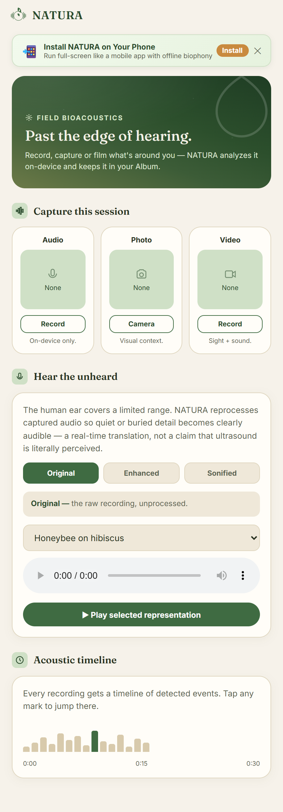
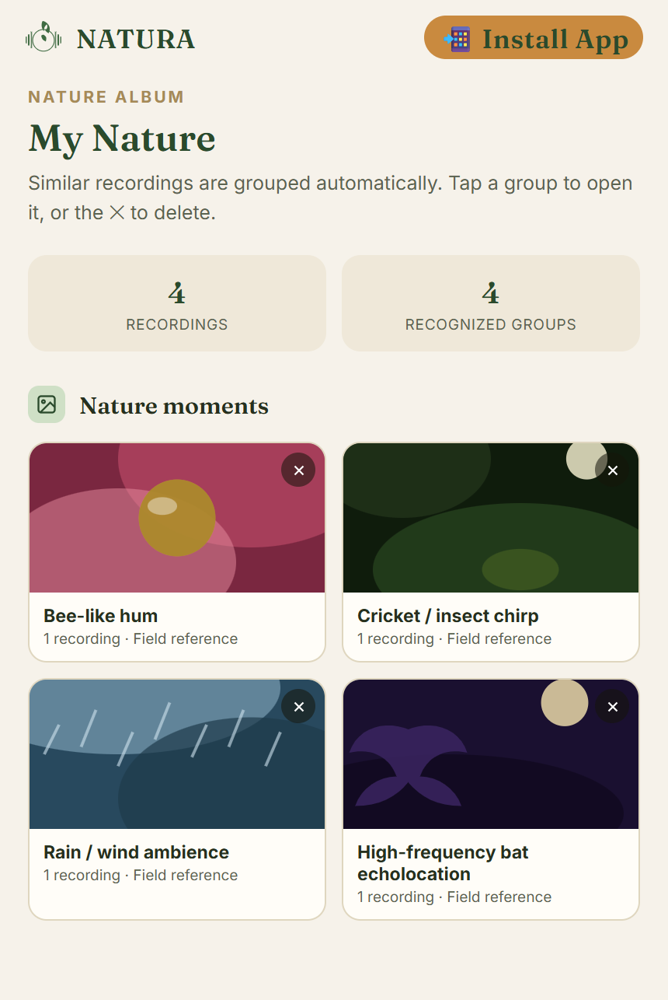
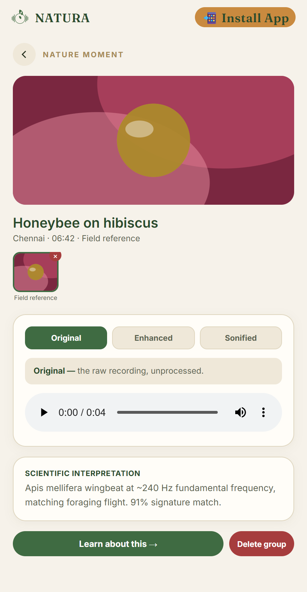
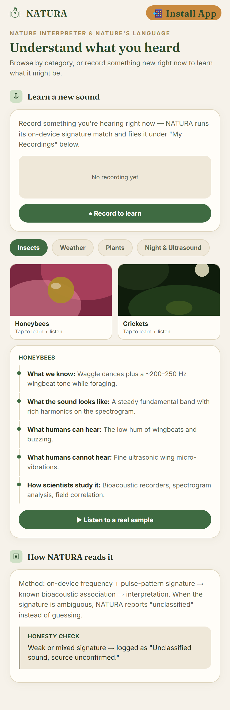
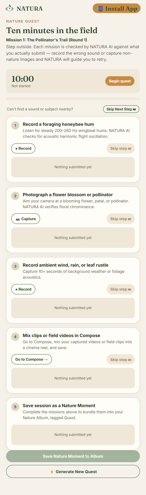
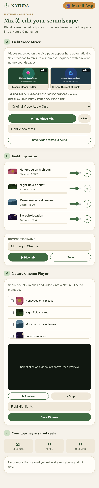

# NATURA — AI Multimodal Nature Explorer
### *Hear Beyond Human Hearing • Use your phone to look beyond the screen*

NATURA turns the **iQOO 15** into an AI-powered multimodal nature explorer. It uses the phone's camera, microphone, sensors, Snapdragon 8 Elite Gen 5 computing platform, stereo speakers, and display to simultaneously observe the environment and build a real-time understanding of the natural world around the user.

---

## 📌 Project Links & Live Access

| Resource | Link | Description |
|---|---|---|
| 🌐 **Live Cloud App (Render)** | [natura.onrender.com](https://natura.onrender.com) | Always-on cloud web deployment |
| 🚀 **Deploy to Render (1-Click)** | [](https://render.com/deploy?repo=https://github.com/preenithi-15/IQOO) | One-click automatic cloud deployment |
| 📱 **Live Mobile Web App (Tunnel)** | [neat-chicken-77.loca.lt](https://neat-chicken-77.loca.lt) | Direct mobile-friendly tunnel *(Password if prompted: `180.235.122.218`)* |
| 🎥 **Video Walkthrough (YouTube)** | [youtu.be/wUA6s3Jvt-o](https://youtu.be/wUA6s3Jvt-o) | Official demo video and feature walkthrough |
| 📁 **Deck & Documentation (Google Drive)** | [Google Drive Folder](https://drive.google.com/drive/folders/1dnt8lG0pz2dyoeDbunn7MX5NnACevtVf?usp=sharing) | Presentation deck, submission documentation, and project assets |

---

## 📱 How to Download & Run as a Mobile App

NATURA is fully optimized as an installable **Progressive Web App (PWA / WebAPK)** with responsive mobile-first UI (`100dvh`), offline caching, and access to device hardware (camera, microphone, accelerometer).

### 🤖 On Android (Google Chrome, Microsoft Edge, Samsung Internet, Brave)
1. Open the mobile link on your phone: **[https://neat-chicken-77.loca.lt](https://neat-chicken-77.loca.lt)** *(If localtunnel asks for a password, enter `180.235.122.218` and tap Click to Submit)* or the cloud link **[https://natura.onrender.com](https://natura.onrender.com)**.
2. Tap the **"📲 Install App"** button at the top of the screen (or tap the **⋮** menu in the top-right and select **"Install app"** / **"Add to Home screen"**).
3. Confirm by tapping **"Install"**.
4. Android will automatically compile and install NATURA as a native **WebAPK** with its own home screen icon and splash screen. The app runs in edge-to-edge full-screen without browser bars.

### 🍎 On iPhone / iPad (Apple Safari)
1. Open **[https://neat-chicken-77.loca.lt](https://neat-chicken-77.loca.lt)** or **[https://natura.onrender.com](https://natura.onrender.com)** in **Safari**.
2. Tap the **Share** button (the square icon with an upward arrow 📤 / ⎋) at the bottom toolbar.
3. Scroll down and tap **"Add to Home Screen"** (➕).
4. Tap **"Add"** in the top right.
5. NATURA is now installed on your iOS home screen and will open in standalone full-screen mode like any native App Store application.

### 📦 Converting to a Standalone Android APK File (.apk)
If you require an installable `.apk` file:
1. Visit **[PWABuilder.com](https://www.pwabuilder.com)** (Microsoft's open-source PWA packaging tool).
2. Enter the live application URL: `https://natura.onrender.com` or `https://neat-chicken-77.loca.lt`.
3. Click **"Start"** and select **"Package for Android"**.
4. Download the generated signed `app-release.apk` package to install directly on any Android smartphone or publish to app stores.

---

## 1. Problem & Innovation
Humans perceive only a tiny fraction of natural biological activity. Much acoustic and vibrational activity occurs outside the human audible range (20 Hz - 20 kHz) or is drowned out by ambient noise. Meanwhile, smartphones normally act as barriers that pull users away from nature.

**NATURA turns the iQOO 15 into a bridge, not a barrier**:
- **SEE**: 50MP computer vision detects species, blooms, and pollinators.
- **HEAR**: High-sensitivity acoustic DSP captures micro-acoustics; heterodyne sonification shifts ultrasonic signals into audible frequencies.
- **DISCOVER**: Multimodal fusion correlates what is seen with what is heard.
- **UNDERSTAND**: Evidence-based Nature Interpreter produces grounded, 3-layer interpretations with confidence levels.
- **EXPERIENCE**: Nature Composer transforms bioacoustics into generative musical soundscapes.
- **SAVE**: Curates discoveries into rich, multi-asset Nature Moments and personal Nature Albums.

---

## 2. Core Architecture
```
[ Microphone ]  --> [ DSP & Adaptive Filter ] --> [ Heterodyne Sonifier ] --> [ Bioacoustic Classifier ]
                                                                                         |
[ Camera ]      --> [ Vision Object Classifier ] ----------------------------------------+--> [ Multimodal Fusion ]
                                                                                         |             |
[ Sensors/GPS ] --> [ Context Engine: Time/Temp/Orientation ] --------------------------+             v
                                                                                         [ Nature Interpreter ]
                                                                                         (3 Layers + Confidence)
                                                                                               |
                                                                         +---------------------+---------------------+
                                                                         v                                           v
                                                              [ Nature Composer ]                           [ Nature Cinema ]
                                                          (Acoustics -> Generative Music)             (Nature Moment Multi-Asset)
```

---

## 3. Quick Start

### Install Dependencies
```bash
pip install -r requirements.txt
```

### Run End-to-End Demo
```bash
python demo/run_demo.py
```

### Launch Web Dashboard / vivo Office Kit Bridge
```bash
python -m app.ui.web_dashboard --port 8080
```
Open `http://localhost:8080` in your browser.

---

## 4. Application Walkthrough & Screenshots

### 1. Live Bioacoustic Capture & Processing

*Real-time multi-sensor field recording (audio, photo, and video) with heterodyne ultrasonic sonification and an interactive acoustic timeline.*

### 2. Nature Album ("My Nature")

*Organized visual catalogue and discovery statistics showcasing all saved nature moments, sightings, and acoustic records.*

### 3. Grounded Nature Interpretation

*In-depth 3-layer scientific analysis comparing raw, filtered, and sonified audio representations with evidence-grounded confidence scores.*

### 4. Nature Language Learning Guide

*Interactive biophony education covering insect wingbeats, cricket stridulation, plant cavitation vibrations, and ultrasonic bat echolocation.*

### 5. 10-Minute Nature Quest

*Gamified micro-exploration missions featuring real-time AI verification, procedural round generation, and step-skipping capabilities.*

### 6. Field Video Mixer & Nature Cinema

*Creative studio for sequencing field video captures, layering natural soundscapes, and generating harmonious nature cinema montages.*

